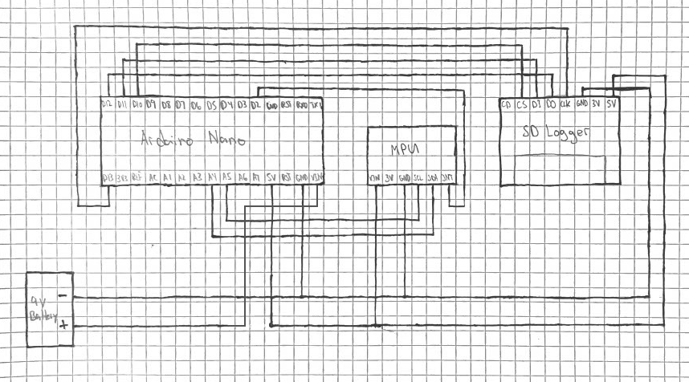

# IMU-Gait-Cycle
An Ardunio project that uses IMU sensors to calculate the yaw, pitch, and yaw to find the orientation of the knee. This information allows us to detect each gait phases and the data collected from this design can be applied in rehabilitation, injury prevention, or identification.

## Gait Cycle
Gait refers to the style of a person's walk. One gait cycle can be broken into two subphases, the swing phase and the stance phase. Those two phases are further broken down into other subphases. Stance phase makes up 60% of the cycle and includes the initial contact, loading response, midstance, terminal stance, and pre-swing. While swing phase is 40% of the cycle and involves the initial swing, mid-swing, and late swing. In this design, we are using the angle and orientation of a person's knee to determine their current gait phase.

  

## Design
Each gait phase has its own unique [characteristics](https://www.youtube.com/watch?v=QAnEhz6Eqn4). By placing our device besides the knee on a horizontal position pointing down, we can use the [yaw](https://www.youtube.com/watch?v=pQ24NtnaLl8) calculated from the sensor to find the current angle of the knee. With these information, we can determine if the person is in a stance phase or swing phase plus its other subphases as well. 

  

### Part List
1. [Arduino Nano](https://www.amazon.com/ELEGOO-Arduino-ATmega328P-Without-Compatible/dp/B0713XK923) - Allows us to use Arduino to program our sensors and collect data.
2. [MPU-6050](https://www.adafruit.com/product/3886) - Uses an accelerometer, an gyroscope, and an magnetometer to caculate the yaw, pitch, and roll.
3. [SD Card Logger](https://www.adafruit.com/product/254) - Stores data from the MPU-6050.
4. [9V Battery](https://www.amazon.com/Energizer-E522-Alkaline-battery-later/dp/B00MNRYY0A/ref=sr_1_7crid=VVUIZ2E1DTJA&dchild=1&keywords=9+volt+battery&qid=1584131898&s=hpc&sprefix=9+v%2Caps%2C210&sr=1-7) - Powers the components.
5. [Battery Clip](https://www.amazon.com/Breadboards-Solderless-Breadboard-Distribution-Connecting/dp/B07DL13RZH/ref=sr_1_3?dchild=1&keywords=breadboard&qid=1609301104&sr=8-3) - Connects the battery to Arduino Nano
6. [Bread Board](https://www.amazon.com/Breadboards-Solderless-Breadboard-Distribution-Connecting/dp/B07DL13RZH/ref=sr_1_3?dchild=1&keywords=breadboard&qid=1609301104&sr=8-3) - Used for prototyping.

### Prototype
  

### Wiring
  

## References
* [Gait Definition](https://www.physio-pedia.com/Gait) 
* [Gait Breakdown](https://www.youtube.com/watch?v=QAnEhz6Eqn4)
* [MPU Calibration](https://wired.chillibasket.com/2015/01/calibrating-mpu6050/)
* [MPU Code](https://maker.pro/arduino/tutorial/how-to-interface-arduino-and-the-mpu-6050-sensor)
* [SD Card Logger SetUp](https://howtomechatronics.com/tutorials/arduino/arduino-sd-card-data-logging-excel-tutorial/)
